|Years|Input|GT-Binarized Image|
|----|----|----|
|2009|||
|2009|||
|2010|||
|2010|||
|2011|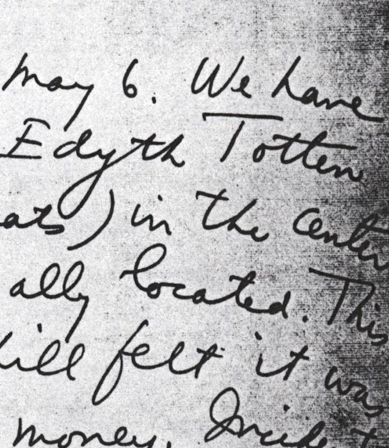|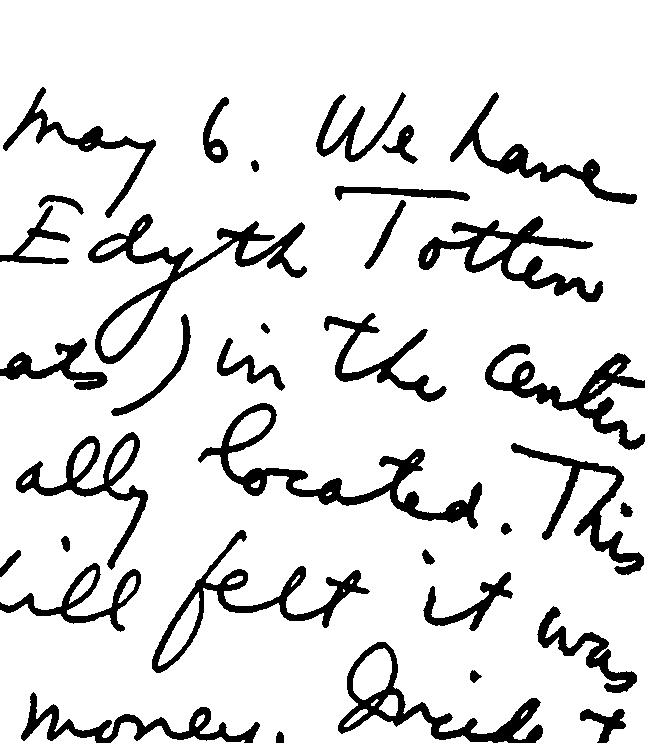|
|2011||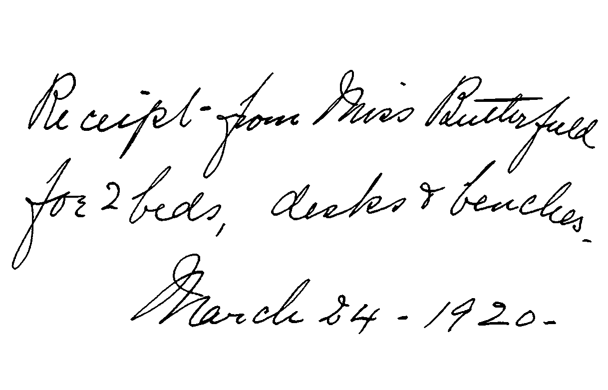|
|2012|||
|2012||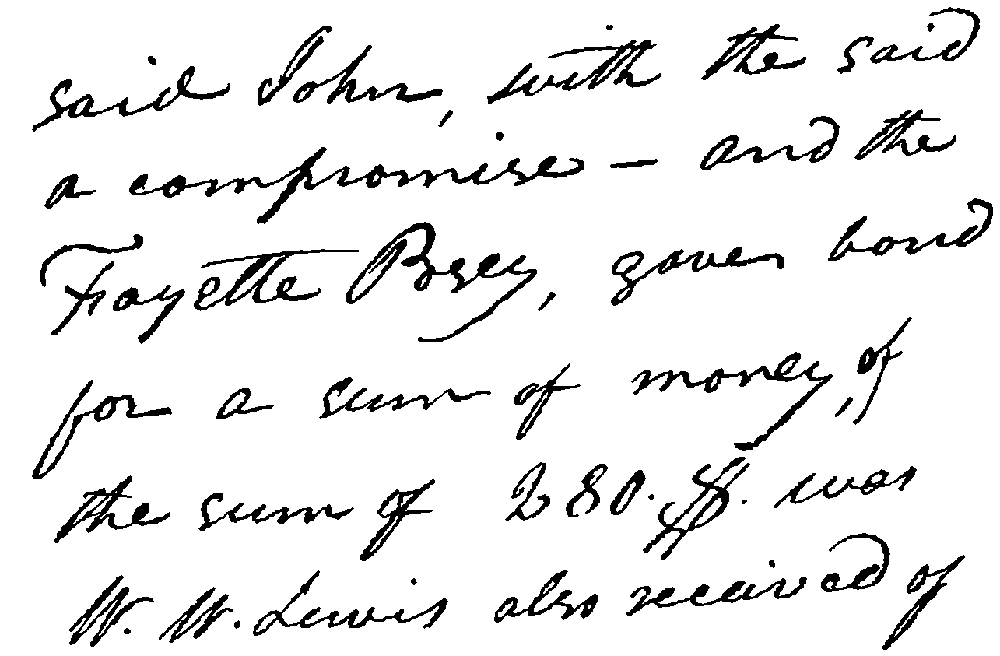|
|2013|||
|2013|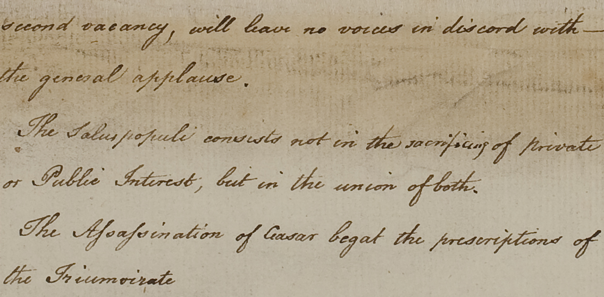|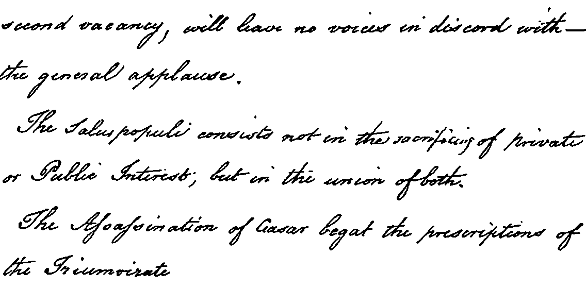|
|2014|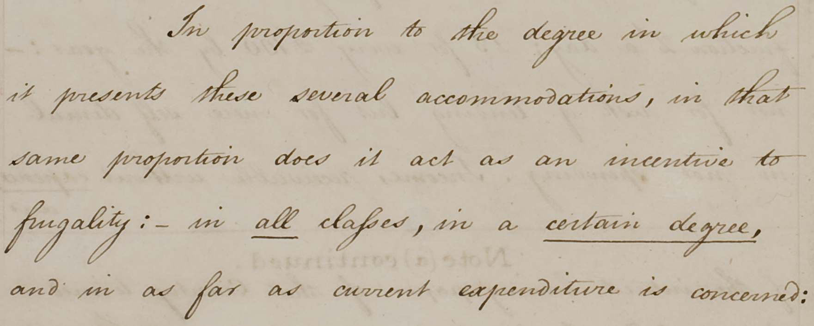|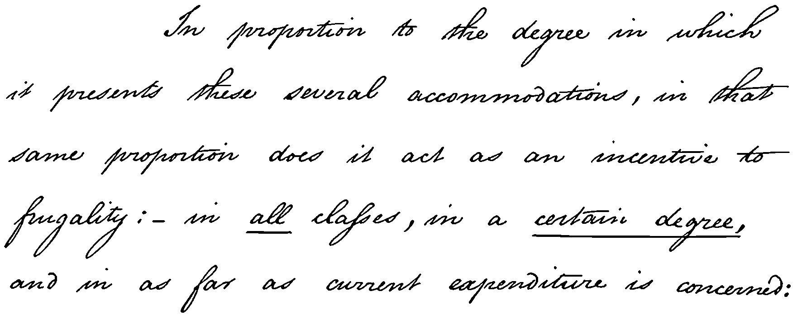|
|2014|||
|2016||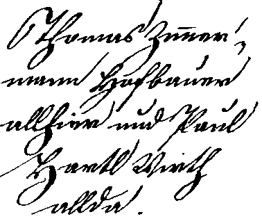|
|2016||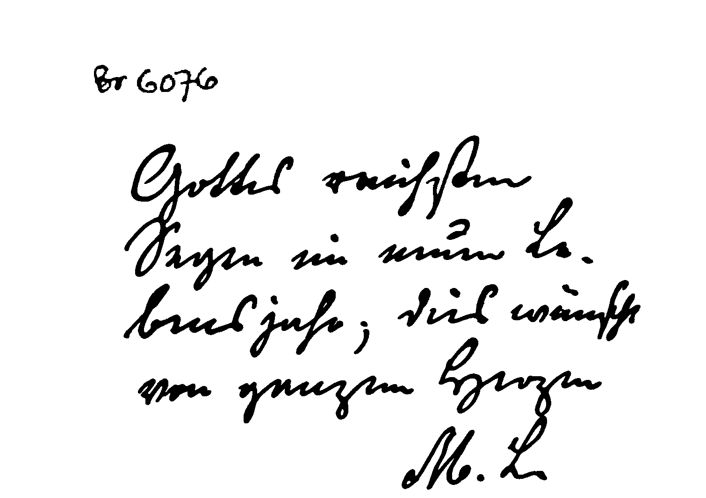|
|2017|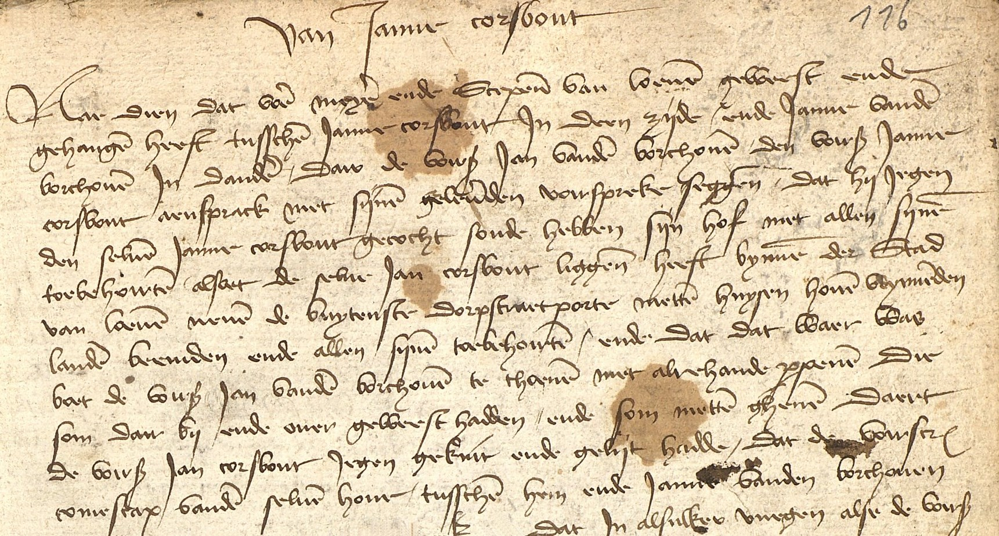||
|2017|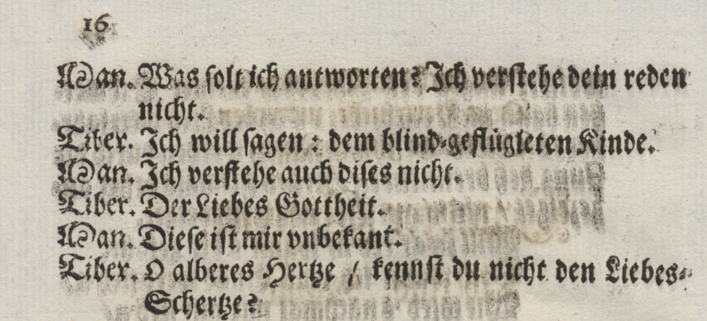|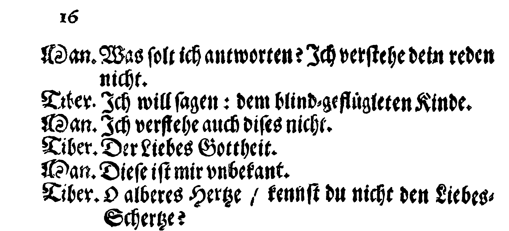|
|2018|||
|2018|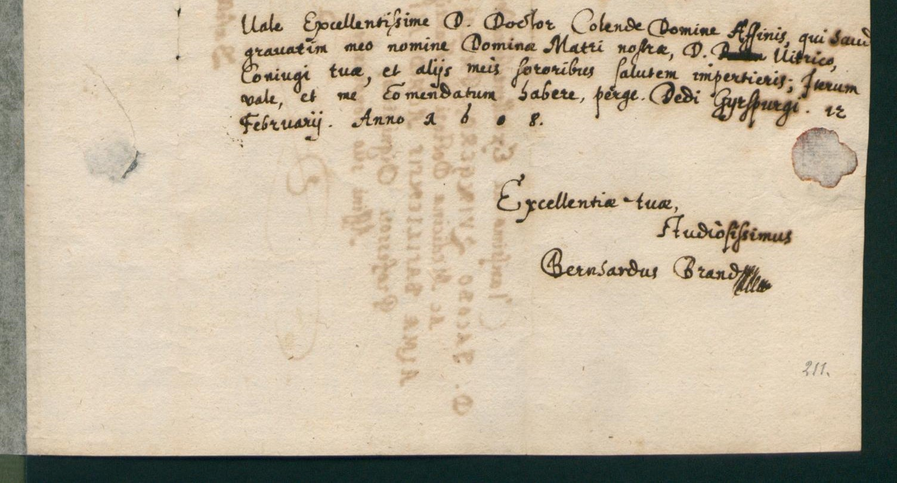|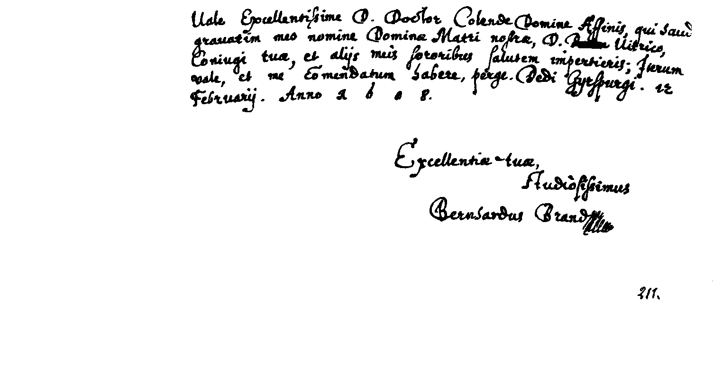|
|2019|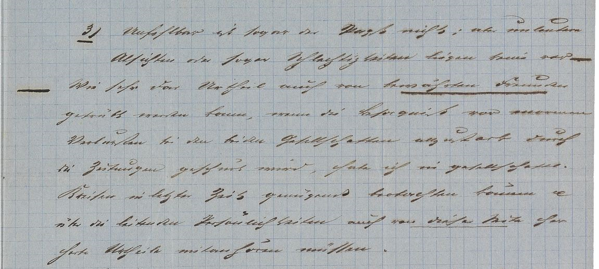|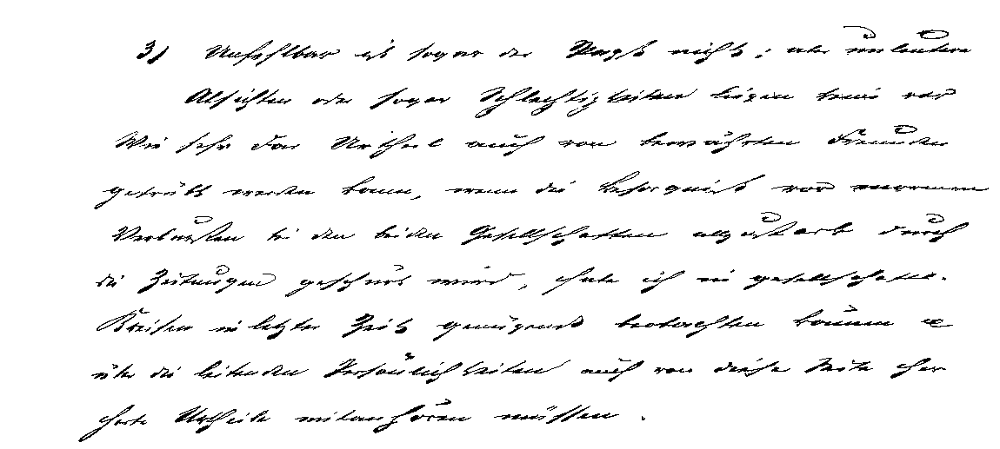|
|2019|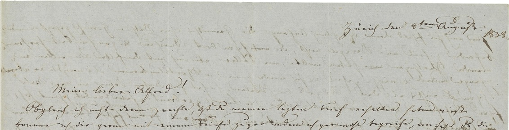|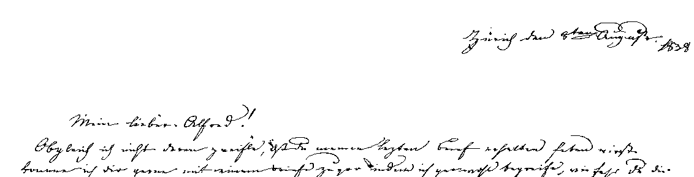|