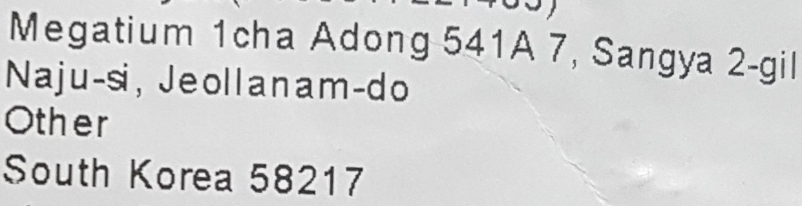
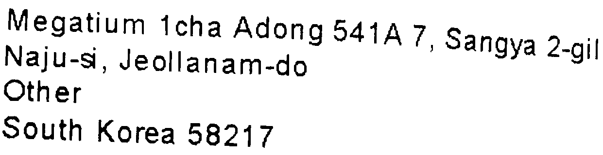
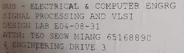
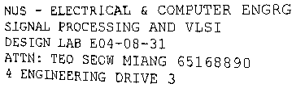

|Input|GT-binarization result|GT-text content|
|----|----|----|
|||Megatium 1cha Adong 541A 7, Sangya 2-gil Naju-si, Jeollanam-do Other South Korea 58217|
|||NUS - ELECTRICAL & COMPUTER ENGRG SIGNAL PROCESSING AND VLSI DESIGN LAB E04-08-31 ATTN: TEO SEOW MIANG 65168890 4 ENGINEERING DRIVE 3|