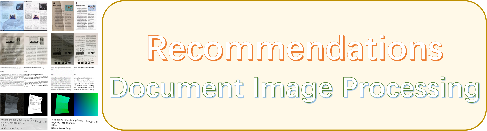

<!-- omit in toc -->
## 📖 Recommendations of Document Image Processing
This repository contains a paper collection of the methods for document image processing, including appearance enhancement, deshadow, dewarping, deblur, and binarization.

<!-- omit in toc -->
## 🔥 Contents
- [1. Appearance Enhancement](#1-appearance-enhancement)
  - [1.1 Papers](#11-papers)
  - [1.2 Datasets](#12-datasets)
  - [1.3 Apps](#13-apps)
  - [1.4 SOTA](#14-sota)
- [2. Deshadow](#2-deshadow)
  - [2.1 Papers](#21-papers)
  - [2.2 Datasets](#22-datasets)
  - [2.3 SOTA](#23-sota)
- [3. Dewarping](#3-dewarping)
  - [3.1 Papers](#31-papers)
  - [3.2 Dataset](#32-dataset)
  - [3.3 SOTA](#33-sota)
- [4. Deblur](#4-deblur)
  - [4.1 Papers](#41-papers)
  - [4.2 Datasets](#42-datasets)
  - [4.3 SOTA](#43-sota)
- [5. Binarization](#5-binarization)
  - [5.1 Papers](#51-papers)
  - [5.2 Datasets](#52-datasets)
  - [5.3 SOTA](#53-sota)
- [⭐ Star Rising](#-star-rising)

## 1. Appearance Enhancement
Appearance enhancement (also known as illumination correction) is not limited to a specific degradation type and aims to restore a clean appearance similar to that obtained from a scanner or digital born PDF files.

### 1.1 Papers
|Year|Venue|Title|Repo|
|----|----|-----|----|
|2019|ACM TOG|[Document Rectification and Illumination Correction using a Patch-based CNN](https://dl.acm.org/doi/abs/10.1145/3355089.3356563)|[Code](https://github.com/xiaoyu258/DocProj)|
|2020|BMVC|[Intrinsic Decomposition of Document Images In-the-wild](https://arxiv.org/abs/2011.14447)|[Code](https://github.com/cvlab-stonybrook/DocIIW)|
|2021|ICCV|[DewarpNet: Single-Image Document Unwarping With Stacked 3D and 2D Regression Networks](https://openaccess.thecvf.com/content_ICCV_2019/html/Das_DewarpNet_Single-Image_Document_Unwarping_With_Stacked_3D_and_2D_Regression_ICCV_2019_paper.html)|[Code](https://github.com/cvlab-stonybrook/DewarpNet)|
|2021|ACM MM|[DocTr: Document Image Transformer for Geometric Unwarping and Illumination Correction](https://arxiv.org/pdf/2110.12942v2.pdf)|[Code](https://github.com/fh2019ustc/DocTr)|
|2022|CVPR|[Fourier Document Restoration for Robust Document Dewarping and Recognition](https://openaccess.thecvf.com/content/CVPR2022/html/Xue_Fourier_Document_Restoration_for_Robust_Document_Dewarping_and_Recognition_CVPR_2022_paper.html)||
|2022|ACM MM|[UDoc-GAN: Unpaired Document Illumination Correction with Background Light Prior](https://dl.acm.org/doi/abs/10.1145/3503161.3547916)|[Code](https://github.com/harrytea/UDoc-GAN)|
|2023|TAI|[Appearance Enhancement for Camera-captured Document Images in the Wild](https://ieeexplore.ieee.org/abstract/document/10268585/)|[Code](https://github.com/ZZZHANG-jx/GCDRNet)|
|2023|ICCVW|[Template-guided Illumination Correction for Document Images with Imperfect Geometric Reconstruction](https://openaccess.thecvf.com/content/ICCV2023W/NIVT/html/Hertlein_Template-Guided_Illumination_Correction_for_Document_Images_with_Imperfect_Geometric_Reconstruction_ICCVW_2023_paper.html)|[Code](https://github.com/FelixHertlein/illtrtemplate-model)|
|2023|ACM MM|[DocDiff: Document Enhancement via Residual Diffusion Models](https://arxiv.org/abs/2305.03892)|[Code](https://github.com/Royalvice/DocDiff)|
|2023|arxiv|[DocStormer: Revitalizing Multi-Degraded Colored Document Images to Pristine PDF Versions](https://arxiv.org/abs/2310.17910)||

### 1.2 Datasets

|Dataset|Num. (train/test)|Type|Example|Download|
|----|----|----|----|----|
|[Doc3DShade](https://arxiv.org/abs/2011.14447)|90K|Sythetic|[Example](./Dataset_image/doc3dshade/doc3dshade.md)|[Link](https://github.com/cvlab-stonybrook/DocIIW)|
|[DocProj](https://dl.acm.org/doi/abs/10.1145/3355089.3356563)|2450|Sythetic|[Example](./Dataset_image/docproj/docproj.md)|[Link](https://github.com/xiaoyu258/DocProj)|
|[DocUNet from DocAligner](https://openaccess.thecvf.com/content_cvpr_2018/html/Ma_DocUNet_Document_Image_CVPR_2018_paper.html)|130|Real|[Example](./Dataset_image/docunet_docaligner/docunet_docaligner.md)|[Link](https://www3.cs.stonybrook.edu/~cvl/docunet.html)|
|[RealDAE](https://ieeexplore.ieee.org/abstract/document/10268585/)|600 (450/150)|Real|[Example](./Dataset_image/realdae/realdae.md)|[Link](https://github.com/ZZZHANG-jx/GCDRNet)|
|[Inv3D](https://link.springer.com/article/10.1007/s10032-023-00434-x)|25K|Sythetic|[Example](./Dataset_image/inv3d/inv3d.md)|[Link](https://github.com/FelixHertlein/inv3d)|

### 1.3 Apps

- [CamScanner](https://www.camscanner.com/)
- [Adobe Acrobat](https://helpx.adobe.com/acrobat/using/enhance-camera-images.html)
- [Lenovo Smart Scanner](https://static.xue.lenovomm.com/scannerpc.html)
- [Quark](https://www.quark.cn/)

### 1.4 SOTA
Coming Soon ...

## 2. Deshadow
Deshadowing aims to eliminate shadows that are mainly caused by occlusion to obtain shadow-free document images.

### 2.1 Papers
|Year|Venue|Title|Repo|
|----|----|-----|----|
|2018|CVPR|[Document Enhancement Using Visibility Detection](https://openaccess.thecvf.com/content_cvpr_2018/html/Kligler_Document_Enhancement_Using_CVPR_2018_paper.html)||
|2020|CVPR|[BEDSR-Net A Deep Shadow Removal Network from a Single Document Image](https://openaccess.thecvf.com/content_CVPR_2020/html/Lin_BEDSR-Net_A_Deep_Shadow_Removal_Network_From_a_Single_Document_CVPR_2020_paper.html)|[Code]([http](https://github.com/IsHYuhi/BEDSR-Net_A_Deep_Shadow_Removal_Network_from_a_Single_Document_Image))|
|2022|ICPR|[Document Shadow Removal with Foreground Detection Learning From Fully Synth Images](https://ieeexplore.ieee.org/abstract/document/9897217)|[Code](https://github.com/IsHYuhi/DSRFGD)|
|2022|MERCon|[Shadow Removal for Documents with Reflective Textured Surface](https://ieeexplore.ieee.org/abstract/document/9906227)||
|2023|ICASSP|[ShaDocNet: Learning Spatial-Aware Tokens in Transformer for Document Shadow Removal](https://arxiv.org/abs/2211.16675)|[Code](https://github.com/CXH-Research/ShadocNet)|
|2023|ICASSP|[Shadow Removal of Text Document Images Using Background Estimation and Adaptive Text Enhancement](https://ieeexplore.ieee.org/abstract/document/10096115)||
|2023|ICASSP|[LP-IOANet: Efficient High Resolution Document Shadow Removal](https://arxiv.org/pdf/2303.12862.pdf)||
|2023|Optical Review|[Shadow removal from document image based on background estimation employing selective median filter and black-top-hat transform](https://link.springer.com/article/10.1007/s10043-023-00806-y)||
|2023|CVPR|[Document Image Shadow Removal Guided by Color-Aware Background](https://openaccess.thecvf.com/content/CVPR2023/html/Zhang_Document_Image_Shadow_Removal_Guided_by_Color-Aware_Background_CVPR_2023_paper.html)|[Code](https://github.com/hyyh1314/BGShadowNet)|
|2023|arxiv|[ShaDocFormer: A Shadow-attentive Threshold Detector with Cascaded Fusion Refiner for document shadow removal](https://arxiv.org/abs/2309.06670)||
|2023|ICCV|[High-Resolution Document Shadow Removal via A Large-Scale Real-World Dataset and A Frequency-Aware Shadow Erasing Net](https://openaccess.thecvf.com/content/ICCV2023/html/Li_High-Resolution_Document_Shadow_Removal_via_A_Large-Scale_Real-World_Dataset_and_ICCV_2023_paper.html)|[Code](https://github.com/CXH-Research/DocShadow-SD7K)|
|2023|Sensors|[Synthetic Document Images with Diverse Shadows for Deep Shadow Removal Networks](https://www.mdpi.com/1424-8220/24/2/654)|[Code](https://github.com/ym4t50/SynDoc4DSFN)|

### 2.2 Datasets

|Dataset|Num. (train/test)|Type|Example|Download|
|----|----|----|----|----|
|[RDD](https://openaccess.thecvf.com/content/CVPR2023/html/Zhang_Document_Image_Shadow_Removal_Guided_by_Color-Aware_Background_CVPR_2023_paper.html)|4916 (4371/545)|Real|[Example](./Dataset_image/rdd/rdd.md)|[Link](https://github.com/hyyh1314/RDD)|
|[Kligler et al.](https://openaccess.thecvf.com/content_cvpr_2018/html/Kligler_Document_Enhancement_Using_CVPR_2018_paper.html)|300|Real|[Example](./Dataset_image/kligler/kligler.md)|[baidu]()|
|[FSDSRD](https://ieeexplore.ieee.org/abstract/document/9897217)|14200|Synth|[Example](./Dataset_image/fsdsrd/fsdsrd.md)|[Link](https://github.com/IsHYuhi/DSRFGD)|
|[Jung et al.](https://link.springer.com/chapter/10.1007/978-3-030-20887-5_25)|87|Real|[Example](./Dataset_image/jung/jung.md)|[Link](https://static-content.springer.com/esm/chp%3A10.1007%2F978-3-030-20887-5_25/MediaObjects/484511_1_En_25_MOESM1_ESM.zip)|
|[OSR](https://www.mdpi.com/1424-8220/20/23/6929)|237|Real|[Example](./Dataset_image/osr/osr.md)|[Link](https://github.com/BingshuCV/DocumentShadowRemoval)|
|[WEZUT OCR](https://www.mdpi.com/1424-8220/20/10/2914)|176|Real|[Example](./Dataset_image/wezut/wezut.md)|[Link](https://okarma.zut.edu.pl/?id=dataset&L=1)|
|[SD7K](https://openaccess.thecvf.com/content/ICCV2023/html/Li_High-Resolution_Document_Shadow_Removal_via_A_Large-Scale_Real-World_Dataset_and_ICCV_2023_paper.html)|7620 (6479/760)|Real|[Example](./Dataset_image/sd7k/sd7k.md)|[Link](https://github.com/CXH-Research/DocShadow-SD7K)|
|[SynDocDS](https://www.mdpi.com/1424-8220/24/2/654)|50K (40K/5K)|Synth||[Link](https://github.com/ym4t50/SynDoc4DSFN)|

### 2.3 SOTA
Coming Soon ...

## 3. Dewarping
Dewarping, also referred to as geometric rectification, aims to rectify document images that suffer from curves, folds, crumples, perspective/affine deformation and other geometric distortions.

### 3.1 Papers
|Year|Venue|Title|Repo|
|----|----|-----|----|
|2018|CVPR|[DocUNet: Document Image Unwarping via A Stacked U-Net](https://openaccess.thecvf.com/content_cvpr_2018/papers/Ma_DocUNet_Document_Image_CVPR_2018_paper.pdf)||
|2019|TOG|[Document Rectification and Illumination Correction using a Patch-based CNN](https://arxiv.org/pdf/1909.09470.pdf)|[Code](https://github.com/xiaoyu258/DocProj)|
|2019|ICCV|[DewarpNet: Single-Image Document Unwarping With Stacked 3D and 2D Regression Networks](https://openaccess.thecvf.com/content_ICCV_2019/papers/Das_DewarpNet_Single-Image_Document_Unwarping_With_Stacked_3D_and_2D_Regression_ICCV_2019_paper.pdf)|[Code](https://github.com/cvlab-stonybrook/DewarpNet)|[Link](https://drive.google.com/drive/folders/1aPfQHGrGxpuIbYLONydbSkGNygRX2z2P?usp=sharing)|
|2020|PR|[Geometric Rectification of Document Images using Adversarial Gated Unwarping Network](https://reader.elsevier.com/reader/sd/pii/S0031320320303794?token=52ED03E7C85352F1F088C41DA2BEED447A34798498EBC41ADF333A84742F53C1904FFED32E91578195D63663F9006F3D&originRegion=us-east-1&originCreation=20220801125708)||
|2020|ECCV|[Can You Read Me Now? Content Aware Rectification using Angle Supervision](https://arxiv.org/pdf/2008.02231.pdf)||
|2020|DAS|[Dewarping Document Image by Displacement Flow Estimation with Fully Convolutional Network](https://arxiv.org/pdf/2104.06815.pdf)|[Code](https://github.com/gwxie/Dewarping-Document-Image-By-Displacement-Flow-Estimation)|
|2021|ACM MM|[DocTr: Document Image Transformer for Geometric Unwarping and Illumination Correction](https://arxiv.org/pdf/2110.12942.pdf)|[Code](https://github.com/fh2019ustc/DocTr)|
|2021|ICCV|[End-to-end Piece-wise Unwarping of Document Images](https://openaccess.thecvf.com/content/ICCV2021/papers/Das_End-to-End_Piece-Wise_Unwarping_of_Document_Images_ICCV_2021_paper.pdf)|[Code](https://github.com/sagniklp/PiecewiseUnwarp)|
|2021|ICDAR|[Document Dewarping with Control Points](https://arxiv.org/pdf/2203.10543.pdf)|[Code](https://github.com/gwxie/Document-Dewarping-with-Control-Points)|
|2022|CVPR|[Fourier Document Restoration for Robust Document Dewarping and Recognition](https://openaccess.thecvf.com/content/CVPR2022/papers/Xue_Fourier_Document_Restoration_for_Robust_Document_Dewarping_and_Recognition_CVPR_2022_paper.pdf)|||
|2022|CVPR|[Revisiting Document Image Dewarping by Grid Regularization](https://openaccess.thecvf.com/content/CVPR2022/papers/Jiang_Revisiting_Document_Image_Dewarping_by_Grid_Regularization_CVPR_2022_paper.pdf)||
|2022|ACM MM|[Marior: Margin Removal and Iterative Content Rectification for Document Dewarping in the Wild](https://arxiv.org/pdf/2207.11515.pdf)||
|2022|SIGGRAPH|[Learning From Documents in the Wild to Improve Document Unwarping](https://dl.acm.org/doi/pdf/10.1145/3528233.3530756)|[Code](https://github.com/cvlab-stonybrook/PaperEdge)|
|2022|ECCV|[Geometric Representation Learning for Document Image Rectification](https://arxiv.org/pdf/2210.08161.pdf)|[Code](https://github.com/fh2019ustc/DocGeoNet)|
|2022|ECCV|[Learning an Isometric Surface Parameterization for Texture Unwrapping](https://www.ecva.net/papers/eccv_2022/papers_ECCV/papers/136970568.pdf)|[Code](https://github.com/cvlab-stonybrook/Iso-UVField)|
|2022|Arxiv|[DocScanner: Robust Document Image Rectification with Progressive Learning](https://drive.google.com/file/d/1mmCUj90rHyuO1SmpLt361youh-07Y0sD/view?usp=share_link)|[Code](https://github.com/fh2019ustc/DocScanner)|
|2022|ICPR|[Document Image Rectification in Complex Scene Using Stacked Siamese Networks](https://ieeexplore.ieee.org/stamp/stamp.jsp?arnumber=9956331&casa_token=3EP6PWPjea0AAAAA:5-ijMq2DXm9fcefC_Y4ryNM3d4deZpi_u6EOIjmZ6K-qp4tNwsHq2Y81xbr42aczVvyuR3xZiT_h)||
|2023|Arxiv|[Geometric Rectification of Creased Document Images based on Isometric Mapping](https://arxiv.org/abs/2212.08365)||
|2023|IJDAR|[Adaptive Dewarping of Severely Warped Camera-captured Document Images Based on Document Map Generation](https://link.springer.com/content/pdf/10.1007/s10032-022-00425-4.pdf?pdf=button)||
|2023|TMM|[Deep Unrestricted Document Image Rectification](https://arxiv.org/abs/2304.08796)|[Code](https://github.com/fh2019ustc/DocTr-Plus)|
|2023|Arxiv|[Neural Document Unwarping using Coupled Grids](https://arxiv.org/pdf/2302.02887.pdf)||
|2023|IJDAR|[Inv3D: A High-resolution 3D Invoice Dataset for Template-guided Single-image Document Unwarping](https://link.springer.com/article/10.1007/s10032-023-00434-x)|[Code](https://github.com/FelixHertlein/inv3d)|
|2023|Arxiv|[MataDoc: Margin and Text Aware Document Dewarping for Arbitrary Boundary](https://arxiv.org/pdf/2307.12571)||
|2023|ICCVW|[Template-guided Illumination Correction for Document Images with Imperfect Geometric Reconstruction](https://openaccess.thecvf.com/content/ICCV2023W/NIVT/papers/Hertlein_Template-Guided_Illumination_Correction_for_Document_Images_with_Imperfect_Geometric_Reconstruction_ICCVW_2023_paper.pdf)|[Code](https://github.com/FelixHertlein/illtrtemplate-model)|
|2023|ICCV|[Foreground and Text-lines Aware Document Image Rectification](https://openaccess.thecvf.com/content/ICCV2023/papers/Li_Foreground_and_Text-lines_Aware_Document_Image_Rectification_ICCV_2023_paper.pdf)|[Code](https://github.com/xiaomore/document-image-dewarping)|
|2023|ACM TOG|[Layout-Aware Single-Image Document Flatening](https://dl.acm.org/doi/pdf/10.1145/3627818)|[Code](https://github.com/BunnySoCrazy/LA-DocFlatten)|[Link](https://github.com/BunnySoCrazy/LA-DocFlatten)|
|2023|WACV|[DocReal: Robust Document Dewarping of Real-Life Images via Attention-Enhanced Control Point Prediction](https://openaccess.thecvf.com/content/WACV2024/papers/Yu_DocReal_Robust_Document_Dewarping_of_Real-Life_Images_via_Attention-Enhanced_Control_WACV_2024_paper.pdf)||
|2023|TCSVT|[Rethinking Supervision in Document Unwarping: A Self-consistent Flow-free Approach](https://ieeexplore.ieee.org/abstract/document/10327775)|||
|2023|SIGGRAPH|[UVDoc: Neural Grid-based Document Unwarping](https://dl.acm.org/doi/fullHtml/10.1145/3610548.3618174)|[Code](https://github.com/tanguymagne/UVDoc)|
|2023|Arxiv|[Polar-Doc: One-Stage Document Dewarping with Multi-Scope Constraints under Polar Representation](https://arxiv.org/abs/2312.07925)||

### 3.2 Dataset
|Dataset|Num.|Type|Example|Download/Codes|
|----|----|----|----|----|
|[DocUNet](https://openaccess.thecvf.com/content_cvpr_2018/papers/Ma_DocUNet_Document_Image_CVPR_2018_paper.pdf)|130|Real|-|[Link](https://www3.cs.stonybrook.edu/~cvl/docunet.html)|
|[Doc3D](https://openaccess.thecvf.com/content_ICCV_2019/papers/Das_DewarpNet_Single-Image_Document_Unwarping_With_Stacked_3D_and_2D_Regression_ICCV_2019_paper.pdf)|100K|Synth|-|[Link](https://github.com/cvlab-stonybrook/doc3D-dataset)|
|[DIW](https://dl.acm.org/doi/abs/10.1145/3528233.3530756)|5K|Real|-|[Link](https://github.com/cvlab-stonybrook/PaperEdge)|
|[WarpDoc](https://openaccess.thecvf.com/content/CVPR2022/papers/Xue_Fourier_Document_Restoration_for_Robust_Document_Dewarping_and_Recognition_CVPR_2022_paper.pdf)|1020|Real|-|[Link](https://sg-vilab.github.io/event/warpdoc)|
|[DIR300](https://arxiv.org/pdf/2210.08161.pdf)|300|Real|-|[Link](https://drive.google.com/drive/folders/1yySouQQ3BlH7OjnUhq4CLuvpX2KXtifX)|
|[DICP](https://arxiv.org/pdf/2203.10543.pdf)|-|Synth|-|[Link](https://github.com/gwxie/Document-Dewarping-with-Control-Points)|
|[DIF](https://arxiv.org/pdf/2104.06815.pdf)|-|Synth|-|[Link](https://github.com/gwxie/Distorted-Image-With-Flow)|
|[Simulated Paper](https://dl.acm.org/doi/pdf/10.1145/3627818)|90K|Synth|-|[Link](https://github.com/BunnySoCrazy/LA-DocFlatten)|

### 3.3 SOTA
Coming Soon ...

## 4. Deblur

### 4.1 Papers
|Year|Venue|Title|Repo|
|----|----|-----|----|
|2019|NIPS|[SVDocNet: Spatially Variant U-Net for Blind Document Deblurring](https://openreview.net/forum?id=Hyx3f65qLS)||
|2019|MTA|[DeepDeblur: text image recovery from blur to sharp](https://link.springer.com/article/10.1007/s11042-019-7251-y)|[code](https://github.com/meijianhan/DeepDeblur)|
|2020|TPAMI|[DE-GAN: A Conditional Generative Adversarial Network for Document Enhancement](https://ieeexplore.ieee.org/document/9187695)|[code](https://github.com/dali92002/DE-GAN)|
|2023|ACM MM|[DocDiff: Document Enhancement via Residual Diffusion ModelscDiff](https://arxiv.org/abs/2305.03892)|[code](https://github.com/Royalvice/DocDiff)|

### 4.2 Datasets
|Dataset|Num. (train/test)|Type|Example|Download|
|----|----|----|----|----|
|[TDD (text deblur dataset)](https://www.fit.vut.cz/research/publication-file/10922/hradis15CNNdeblurring.pdf)|67.6K (66K/1.6K)|Synthetic|[Example](./Dataset_image/tdd/tdd.md)|[Link](http://www.fit.vutbr.cz/~ihradis/CNN-Deblur/)|

### 4.3 SOTA
Comding Soon ...

## 5. Binarization

### 5.1 Papers
|Year|Venue|Title|Repo|
|----|----|-----|----|
|2019|PR|[DeepOtsu: Document enhancement and binarization using iterative deep learning](https://www.sciencedirect.com/science/article/pii/S0031320319300330)|[code](https://www.ai.rug.nl/~sheng/DeepOtsu.html)|
|2021|PR|[Complex image processing with less data—Document image binarization by integrating multiple pre-trained U-Net modules](https://www.sciencedirect.com/science/article/pii/S0031320320303800)|[code](https://www.ai.rug.nl/~sheng/DeepOtsu.html)|
|2022|PR|[Two-Stage Generative Adversarial Networks for Binarization of Color Document Images](https://www.sciencedirect.com/science/article/pii/S0031320322002916)|[code](https://github.com/opensuh/DocumentBinarization)|
|2023|PR|[GDB: Gated Convolutions-based Document Binarization](https://www.sciencedirect.com/science/article/pii/S0031320323006878)|[code](https://github.com/Royalvice/GDB)|
|2023|ACM MM|[DocDiff: Document Enhancement via Residual Diffusion ModelscDiff](https://arxiv.org/abs/2305.03892)|[code](https://github.com/Royalvice/DocDiff)|
|2023|ICDAR|[ColDBin: Cold Diffusion for Document Image Binarization](https://link.springer.com/chapter/10.1007/978-3-031-41734-4_13)|[code](https://github.com/saifullah3396/coldbin)|
|2023|IF|[A Novel Degraded Document Binarization Model through Vision Transformer Network](https://www.sciencedirect.com/science/article/pii/S1566253522002597)||

### 5.2 Datasets

|Dataset|Num.|Type|Example|Download|
|----|----|----|----|----|
|[DocEng 2019]()|15|Real|-|[Link](https://github.com/hyyh1314/RDD)|
|[DocEng 2020]()|32|Real|-|[Link](https://github.com/hyyh1314/RDD)|
|[DocEng 2021]()|222|Real|-|[Link](https://github.com/hyyh1314/RDD)|
|[DocEng 2022]()|80|Real|-|[Link](https://github.com/hyyh1314/RDD)|
|[DIBCO 2009](https://openaccess.thecvf.com/content/CVPR2023/html/Zhang_Document_Image_Shadow_Removal_Guided_by_Color-Aware_Background_CVPR_2023_paper.html)|10|Real|-|[Link](https://github.com/hyyh1314/RDD)|
|[H-DIBCO 2010](https://openaccess.thecvf.com/content/CVPR2023/html/Zhang_Document_Image_Shadow_Removal_Guided_by_Color-Aware_Background_CVPR_2023_paper.html)|10|Real|-|[Link](https://github.com/hyyh1314/RDD)|
|[DIBCO 2011](https://openaccess.thecvf.com/content/CVPR2023/html/Zhang_Document_Image_Shadow_Removal_Guided_by_Color-Aware_Background_CVPR_2023_paper.html)|16|Real|-|[Link](https://github.com/hyyh1314/RDD)|
|[H-DIBCO 2012](https://openaccess.thecvf.com/content/CVPR2023/html/Zhang_Document_Image_Shadow_Removal_Guided_by_Color-Aware_Background_CVPR_2023_paper.html)|14|Real|-|[Link](https://github.com/hyyh1314/RDD)|
|[DIBCO 2013](https://openaccess.thecvf.com/content/CVPR2023/html/Zhang_Document_Image_Shadow_Removal_Guided_by_Color-Aware_Background_CVPR_2023_paper.html)|16|Real|-|[Link](https://github.com/hyyh1314/RDD)|
|[H-DIBCO 2014](https://openaccess.thecvf.com/content/CVPR2023/html/Zhang_Document_Image_Shadow_Removal_Guided_by_Color-Aware_Background_CVPR_2023_paper.html)|10|Real|-|[Link](https://github.com/hyyh1314/RDD)|
|[H-DIBCO 2016](https://openaccess.thecvf.com/content/CVPR2023/html/Zhang_Document_Image_Shadow_Removal_Guided_by_Color-Aware_Background_CVPR_2023_paper.html)|10|Real|-|[Link](https://github.com/hyyh1314/RDD)|
|[DIBCO 2017](https://openaccess.thecvf.com/content/CVPR2023/html/Zhang_Document_Image_Shadow_Removal_Guided_by_Color-Aware_Background_CVPR_2023_paper.html)|20|Real|-|[Link](https://github.com/hyyh1314/RDD)|
|[DIBCO 2018](https://openaccess.thecvf.com/content/CVPR2023/html/Zhang_Document_Image_Shadow_Removal_Guided_by_Color-Aware_Background_CVPR_2023_paper.html)|10|Real|-|[Link](https://github.com/hyyh1314/RDD)|
|[DIBCO 2019](https://openaccess.thecvf.com/content/CVPR2023/html/Zhang_Document_Image_Shadow_Removal_Guided_by_Color-Aware_Background_CVPR_2023_paper.html)|10|Real|-|[Link](https://github.com/hyyh1314/RDD)|
|[Bickly-diary](https://dl.acm.org/doi/abs/10.1145/1816123.1816161)|7|Real|-|[Link](https://1drv.ms/f/s!Ak15mSdV3Wy4iY4sW5gm7ak4aWjtFQ?e=1l7vRi)|
|[Synchromedia Multispectral (MSI)](https://www.sciencedirect.com/science/article/pii/S0031320313000642)|240|Real|-|[Link](ttps://tc11.cvc.uab.es/datasets/SMADI_1)|
|[Persian Heritage Image Binarization （PHIBD）](https://ieeexplore.ieee.org/abstract/document/6528442)|15|Real|-|[Link](http://www.iapr-tc11.org/mediawiki/index.php/Persian_Heritage_Image_Binarization_Dataset_(PHIBD_2012))|
|[Palm Leaf]()|50|Real|-|[Link](http://amadi.univ-lr.fr/ICFHR2016_Contest/index.php/download-123)|
|[NoiseOffice]()|216|Synthetic|-|[Link](https://archive.ics.uci.edu/dataset/318/noisyoffice)|
|[LRDE Document Binarization Dataset]()|125|Real|-|[Link](https://www.lrde.epita.fr/wiki/Olena/DatasetDBD)|
|[Shipping label dataset](https://www.sciencedirect.com/science/article/pii/S0031320322002916)|1082|Real|[Example](./Dataset_image/shipping/shipping.md)|[Link](https://www.dropbox.com/sh/gqqugvclzltfldt/AACNELpHwTW-1bHLZzipxQWja?dl=0)|

### 5.3 SOTA
Coming Soon ...

## ⭐ Star Rising

